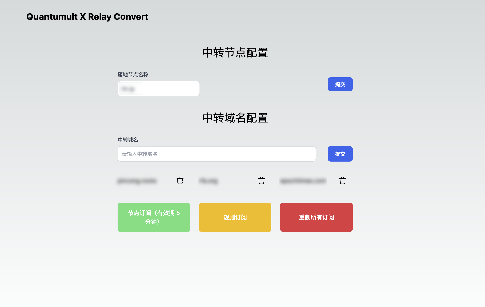

# 自行部署步骤

## .env 文件

把 .env.sample 文件重命名为 .env.local。

## Turso 初始化

配置信息使用 Turso 的数据库保存，这是唯一的外部依赖。在网页端授权 Github 登陆创建好账号后，可以在本地安装 [Turso Cli](https://docs.turso.tech/reference/turso-cli) 工具，安装好后：

1. turso auth login
2. turso db create [db-name]
3. turso db show [db-name] --url
4. turso db tokens create [db-name]

把第三行和第四行的输出分别填写到 .env.local 的第一行和第二行。

## Turso 建表

输入 turso db shell [db-name] 命令，这会开启一个 SQL 会话，把 [SQL 的建表语句](../db/create_table.sql)输入进去。

## 最后

把本目录拷贝到服务器上，然后：

1. pnpm build
2. pnpm start

即可运行。

## 效果图

